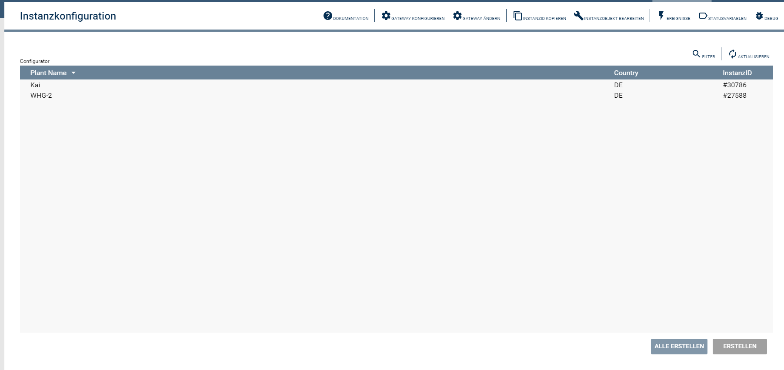

# HomeControl
   Dieses IP-Symcon Modul stellt eine Verbindung zu der Legrand Cloud her um die Legrand Geräte in IP-Symcon einzubinden.
 
   ## Inhaltverzeichnis
   1. [Voraussetzungen](#1-voraussetzungen)
   2. [Enthaltene Module](#2-enthaltene-module)
   3. [Installation](#3-installation)
   4. [Konfiguration in IP-Symcon](#4-konfiguration-in-ip-symcon)
   5. [Spenden](#5-spenden)
   6. [Lizenz](#6-lizenz)
   
## 1. Voraussetzungen

* mindestens IPS Version 5.2
* eine gültige IP-Symcon Subscription

## 2. Enthaltene Module

* [HCCloud](HCCloud/README.md)
* [HCConfigurator](HCConfigurator/README.md)
* [HCDeviceAutomations](HCDeviceAutomations/README.md)
* [HCDeviceLight](HCDeviceLight/README.md)
* [HCDevicePlug](HCDevicePlug/README.md)
* [HCDeviceRemote](HCDeviceRemote/README.md)
* [HCDeviceScenes](HCDeviceScenes/README.md)
* [HCdiscovery](HCdiscovery/README.md)
* [HCSplitter](HCSplitter/README.md)

## 3. Installation
Installation über den IP-Symcon Module Store.

## 4. Konfiguration in IP-Symcon
Als erstes muss die Discovery Instanz erstellt werden.

Die Discovery Instanz erstellt die HCCloud Instanz, innerhalb dieser Instanz muss die Verbindung zu der Legrand Clound hergestellt werden.
Um Verbidnung mit der Legrand Cloud herzustellen muss der Button "Registrieren" 
betätigt werden, daraufhin öffent sich der Registrierungsprozess mit der Cloud.

Nach erfolgriecher Registrierung, werden in der Discovery Instanz alle Gateways angezeigt, welche mit dem Legrand Account verknüpft sind.

Diese Gateways können über die Discovery Instanz angelegt werden, in IP-Symcon wird dann ein Configurator für das ausgerwählte Gateway angelegt.

Mithilfe des Configurators können die einzelnen Instanzen (Light, Plug, Remote Automations und Szenen) angelegt werden.

Innerhalb der Splitter Insatnz kann eingestellt werden, in welchem Intervall der Status der Geräte abgefragt werden soll.

## 5. Spenden

Dieses Modul ist für die nicht kommzerielle Nutzung kostenlos, Schenkungen als Unterstützung für den Autor werden hier akzeptiert:    

## 6. Lizenz

[CC BY-NC-SA 4.0](https://creativecommons.org/licenses/by-nc-sa/4.0/)